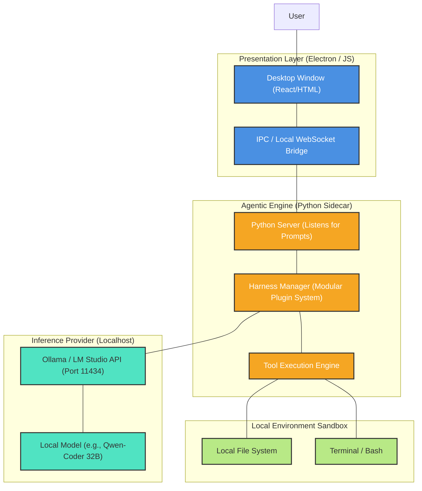
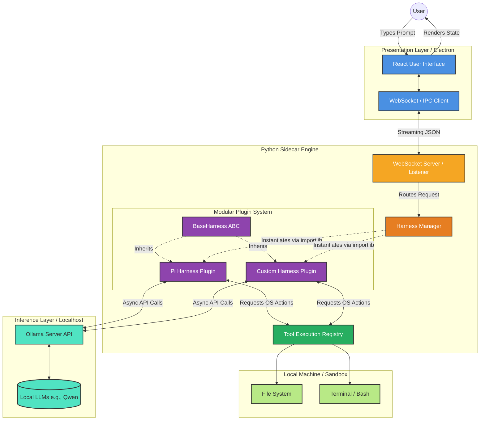

# Project Lowkey: Master Specification & Architecture Document

---

## 1. Product Vision

**Lowkey** is a local-first, privacy-centric "vibe coding" desktop application. 

It empowers users to build software by describing their intent in natural language (the "vibe"), while the AI handles the complex execution (planning, writing files, testing, and debugging). Unlike cloud-based solutions (e.g., Emergent, Cursor), **Lowkey runs entirely locally**. Zero code, prompts, or proprietary data ever leave the user's machine.

---

## 2. The Hybrid "Sidecar" Architecture

Building a desktop app with heavy AI requirements demands a hybrid approach. 
*   We want the beautiful, cross-platform UI capabilities of web technologies.
*   We *must* use Python for the backend because the most powerful agentic frameworks and harnesses are written exclusively in Python.

To solve this, Lowkey uses a **Sidecar Architecture**:

1.  **The UI Wrapper (Electron / React):** Handles rendering the application window and interacting with the user.
2.  **The Core Engine (Python Sidecar):** A standalone Python process that runs silently in the background. It receives prompts from Electron via local IPC (Inter-Process Communication) or WebSockets.
3.  **The Inference Layer (Ollama):** The Python engine communicates with local models (like Qwen2.5-Coder 32B) hosted via Ollama on `localhost:11434`.

---

## 3. High-Level Design (HLD) Diagram

---

## 4. Key Engineering Decisions

### A. Modular Harness System (Plugin Architecture)
Instead of hardcoding a single agent framework, the Python Engine uses a **Modular Harness System**. 
*   **The Problem:** Bundling heavy frameworks like Pi or Hermes into the default installer will bloat the application.
*   **The Solution:** Lowkey ships with a lightweight core loop. Users can dynamically download and install specific harnesses (like the Pi Harness or Hermes) as "plugins" based on their hardware capabilities and preferences.

### B. Distribution via PyInstaller
End-users should *never* have to manually install Python or manage `pip` environments.
*   When preparing for distribution, the entire Python sidecar (along with any active harnesses) will be compiled into a single executable binary using **PyInstaller**.
*   This binary is packaged *inside* the Electron app, offering a seamless, 1-click installation.

---

## 5. Development Roadmap (Action Plan for New Session)

When starting development, follow this exact sequence to ensure the foundation is robust:

**Phase 1: Backend First (Python Engine)**
*   Ignore the UI completely.
*   Initialize the Python virtual environment (`backend/`).
*   Build the `engine.py` script that acts as the local server.
*   Implement the `HarnessManager` interface.
*   **Goal:** Successfully send a JSON prompt to `engine.py` via terminal, have it use Ollama to write a file to the filesystem, and return a success message.

**Phase 2: The Barebones Wrapper (Electron)**
*   Initialize the Electron project (`frontend/`).
*   Configure `main.js` to automatically spawn the Python `engine.py` as a child process when the app opens.
*   Build a dead-simple HTML input box to pass strings to the Python process and print the logs.

**Phase 3: The "Vibe" (React UI)**
*   Once the backend and IPC bridge are proven, upgrade the Electron frontend to use React.
*   Implement a stunning, modern dark-mode aesthetic with glassmorphism and fluid animations to fulfill the premium "vibe coding" experience.

# Lowkey Harness Architecture Diagram

Here is a detailed, high-level visualization of the Lowkey Architecture, focusing specifically on how the modular harness system integrates with the frontend, the tools, and the local inference layer.

### Key Data Flows:
1. **The Vibe Loop**: The User types a prompt into the `React UI`, which streams over WebSockets to the `Python Sidecar`. 
2. **Harness Orchestration**: The `Harness Manager` determines which harness is currently active (e.g., `Pi Harness Plugin`) and passes the prompt to it.
3. **Inference & Execution**: The active harness speaks to `Ollama` to decide the next steps, then calls methods on the `Tool Execution Registry` (like writing files or running terminal commands).
4. **Streaming Response**: As the harness works, it streams its status and token output back up the chain to the `React UI`, keeping the UI deeply synchronized with the backend.

uvicorn engine:app --host 127.0.0.1 --port 8000 --reload
python3 -m http.server 8001
