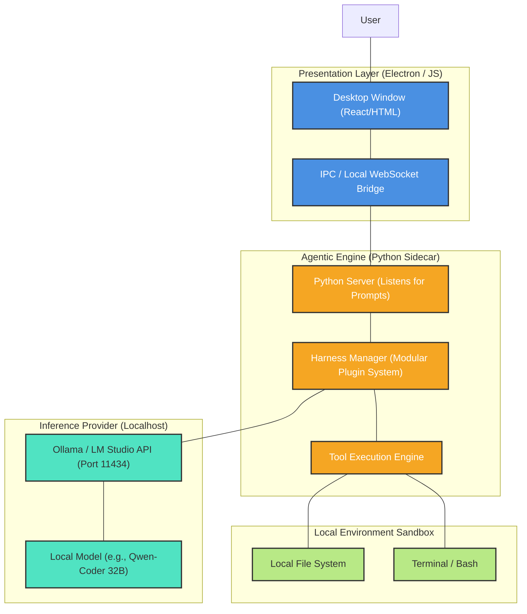
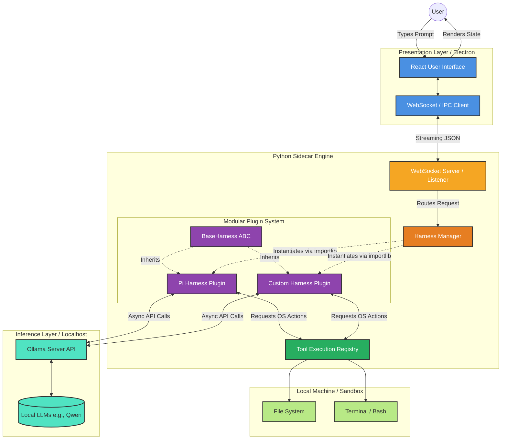
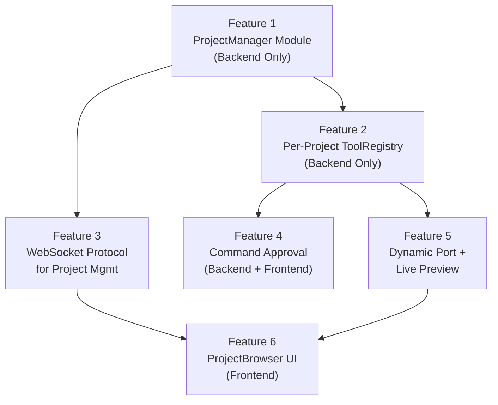

# Project Lowkey: Master Specification & Architecture Document

---

## 1. Product Vision

**Lowkey** is a local-first, privacy-centric "vibe coding" desktop application. 

It empowers users to build software by describing their intent in natural language (the "vibe"), while the AI handles the complex execution (planning, writing files, testing, and debugging). Unlike cloud-based solutions (e.g., Emergent, Cursor), **Lowkey runs entirely locally**. Zero code, prompts, or proprietary data ever leave the user's machine.

---

## 2. The Hybrid "Sidecar" Architecture

Building a desktop app with heavy AI requirements demands a hybrid approach. 
*   We want the beautiful, cross-platform UI capabilities of web technologies.
*   We *must* use Python for the backend because the most powerful agentic frameworks and harnesses are written exclusively in Python.

To solve this, Lowkey uses a **Sidecar Architecture**:

1.  **The UI Wrapper (Electron / React):** Handles rendering the application window and interacting with the user.
2.  **The Core Engine (Python Sidecar):** A standalone Python process that runs silently in the background. It receives prompts from Electron via local IPC (Inter-Process Communication) or WebSockets.
3.  **The Inference Layer (Ollama):** The Python engine communicates with local models (like Qwen2.5-Coder 32B) hosted via Ollama on `localhost:11434`.

---

## 3. High-Level Design (HLD) Diagram



---

## 4. Key Engineering Decisions

### A. Modular Harness System (Plugin Architecture)
Instead of hardcoding a single agent framework, the Python Engine uses a **Modular Harness System**. 
*   **The Problem:** Bundling heavy frameworks like Pi or Hermes into the default installer will bloat the application.
*   **The Solution:** Lowkey ships with a lightweight core loop. Users can dynamically download and install specific harnesses (like the Pi Harness or Hermes) as "plugins" based on their hardware capabilities and preferences.

### B. Distribution via PyInstaller
End-users should *never* have to manually install Python or manage `pip` environments.
*   When preparing for distribution, the entire Python sidecar (along with any active harnesses) will be compiled into a single executable binary using **PyInstaller**.
*   This binary is packaged *inside* the Electron app, offering a seamless, 1-click installation.

---

## 5. Development Roadmap (Action Plan for New Session)

When starting development, follow this exact sequence to ensure the foundation is robust:

**Phase 1: Backend First (Python Engine)**
*   Ignore the UI completely.
*   Initialize the Python virtual environment (`backend/`).
*   Build the `engine.py` script that acts as the local server.
*   Implement the `HarnessManager` interface.
*   **Goal:** Successfully send a JSON prompt to `engine.py` via terminal, have it use Ollama to write a file to the filesystem, and return a success message.

**Phase 2: The Barebones Wrapper (Electron)**
*   Initialize the Electron project (`frontend/`).
*   Configure `main.js` to automatically spawn the Python `engine.py` as a child process when the app opens.
*   Build a dead-simple HTML input box to pass strings to the Python process and print the logs.

**Phase 3: The "Vibe" (React UI)**
*   Once the backend and IPC bridge are proven, upgrade the Electron frontend to use React.
*   Implement a stunning, modern dark-mode aesthetic with glassmorphism and fluid animations to fulfill the premium "vibe coding" experience.


# Lowkey Harness Architecture Diagram

Here is a detailed, high-level visualization of the Lowkey Architecture, focusing specifically on how the modular harness system integrates with the frontend, the tools, and the local inference layer.



### Key Data Flows:
1. **The Vibe Loop**: The User types a prompt into the `React UI`, which streams over WebSockets to the `Python Sidecar`. 
2. **Harness Orchestration**: The `Harness Manager` determines which harness is currently active (e.g., `Pi Harness Plugin`) and passes the prompt to it.
3. **Inference & Execution**: The active harness speaks to `Ollama` to decide the next steps, then calls methods on the `Tool Execution Registry` (like writing files or running terminal commands).
4. **Streaming Response**: As the harness works, it streams its status and token output back up the chain to the `React UI`, keeping the UI deeply synchronized with the backend.
--------------------------------------------------------------------------------------------------------
# Lowkey — Feature-Wise Implementation Plan

The full sandbox/project/preview system broken into **6 independent features**, each small enough to build, test, and verify before moving to the next.

---

## Feature Map



**Features 1 → 2 → 4 → 5** are the critical backend path.  
**Features 1 → 3 → 6** are the frontend/UI path.  
Both paths converge at Feature 6.

---

## Feature 1: ProjectManager Module (Backend Only)

**Goal**: A standalone Python module that manages `~/.lowkey/projects/` — creating, listing, deleting, and opening project directories. No changes to existing files. Pure backend, testable in isolation.

### Scope
- New file: `backend/project_manager.py`
- Creates `~/.lowkey/projects/` on first call if it doesn't exist
- No coupling to ToolRegistry, Engine, or WebSocket

### What It Does

| Method | Description |
|--------|-------------|
| `create_project(name)` | Creates `~/.lowkey/projects/<name>/`, validates name (slug-safe, no collisions), returns `ProjectInfo` |
| `list_projects()` | Scans directory, returns list of `ProjectInfo` with status/port/pid |
| `get_project(name)` | Returns single `ProjectInfo` |
| `delete_project(name)` | Kills any running processes, removes directory |
| `open_in_finder(name)` | Runs `open <path>` (macOS) / `explorer <path>` (Windows) |
| `suggest_name(base_name)` | Given a base like `todo-app`, returns `todo-app` if available, or `todo-app-2`, `todo-app-3`, etc. |

### Project Name Strategy
- The LLM will generate a project name from the first prompt (via a small, fast separate LLM call: "Generate a short kebab-case project name for: {prompt}").
- The backend validates uniqueness via `suggest_name()`.
- The frontend shows the suggested name and lets the user **edit it** before confirming.
- Names are validated: lowercase, kebab-case, no special chars, max 50 chars.

### `ProjectInfo` Dataclass
```python
@dataclass
class ProjectInfo:
    name: str
    path: Path
    status: str         # "running" | "stopped"
    port: int | None
    pid: int | None
    created_at: str     # ISO timestamp
    last_opened: str    # ISO timestamp
```

Project metadata is stored in a lightweight `~/.lowkey/projects/<name>/.lowkey_meta.json` file inside each project, so we don't need a global database.

### Files Changed
| File | Action |
|------|--------|
| `backend/project_manager.py` | **NEW** |

### How to Verify
```bash
# Quick smoke test in Python REPL
python3 -c "
from project_manager import ProjectManager
pm = ProjectManager()
p = pm.create_project('test-project')
print(p)
print(pm.list_projects())
pm.delete_project('test-project')
print(pm.list_projects())
"
```

---

## Feature 2: Per-Project ToolRegistry (Backend Only)

**Goal**: Refactor `ToolRegistry` so it's instantiated per-project (scoped to a specific project directory under `~/.lowkey/projects/`), not globally. The existing sandbox jail logic stays, but now it's project-aware.

### Scope
- Modify: `backend/tools/registry.py`
- Modify: `backend/engine.py` (change how `ToolRegistry` is instantiated)

### What Changes

**registry.py:**
- Constructor now takes a `Path` (project path) instead of a string sandbox dir.
- Add double-validation: path must exist AND be under `~/.lowkey/projects/`.
- `background_processes` dict now stores `(pid, port, command)` tuples for richer tracking.
- Add `get_active_processes()` → returns list of running process info.

**engine.py:**
- Remove global `SANDBOX_DIR` and global `tool_registry`.
- Each WebSocket session stores its own `active_project` and `tool_registry`.
- When user sends `open_project` action, instantiate a fresh `ToolRegistry(project_path)`.
- On disconnect, call `registry.cleanup()`.

### Files Changed
| File | Action |
|------|--------|
| `backend/tools/registry.py` | **MODIFY** |
| `backend/engine.py` | **MODIFY** |

### How to Verify
- Start backend, connect via WebSocket.
- Send `{ "action": "open_project", "name": "test-project" }`.
- Send a prompt that writes a file → verify file lands in `~/.lowkey/projects/test-project/`.
- Try a path traversal (`../../etc/passwd`) → verify rejection.
- Open a second WebSocket connection with a different project → verify isolation.

---

## Feature 3: WebSocket Protocol for Project Management

**Goal**: Add new WebSocket message types so the frontend can create, list, open, and delete projects. This is the **API layer** between frontend and `ProjectManager`.

### Scope
- Modify: `backend/engine.py` (add message routing for project actions)
- No frontend changes yet (test with a WebSocket client like `websocat` or browser console)

### New Message Types (Frontend → Backend)

| Action | Payload |
|--------|---------|
| `create_project` | `{ "action": "create_project", "name": "todo-app" }` |
| `list_projects` | `{ "action": "list_projects" }` |
| `open_project` | `{ "action": "open_project", "name": "todo-app" }` |
| `delete_project` | `{ "action": "delete_project", "name": "todo-app" }` |
| `open_in_finder` | `{ "action": "open_in_finder", "name": "todo-app" }` |

### Response Types (Backend → Frontend)

| Type | Payload |
|------|---------|
| `project_list` | `{ "type": "project_list", "projects": [...] }` |
| `project_created` | `{ "type": "project_created", "project": {...} }` |
| `project_opened` | `{ "type": "project_opened", "project": {...} }` |
| `project_deleted` | `{ "type": "project_deleted", "name": "..." }` |
| `error` | `{ "type": "error", "content": "..." }` |

### Files Changed
| File | Action |
|------|--------|
| `backend/engine.py` | **MODIFY** |

### How to Verify
```bash
# Using websocat or browser console
ws = new WebSocket('ws://127.0.0.1:8000/ws')
ws.send(JSON.stringify({ action: "create_project", name: "test-app" }))
ws.send(JSON.stringify({ action: "list_projects" }))
ws.send(JSON.stringify({ action: "delete_project", name: "test-app" }))
```

---

## Feature 4: Command Approval System (Backend + Frontend)

**Goal**: When the agent calls `execute_command` or `run_background_command`, the system pauses, sends an approval request to the user, and waits for their response before executing.

### Scope
- Modify: `backend/tools/registry.py` (approval logic + blacklist)
- Modify: `backend/tools/schemas.py` (add `reason` param)
- Modify: `backend/config/prompts.py` (safety rules in system prompt)
- Modify: `backend/plugins/coding_harness.py` (async approval flow)
- Modify: `backend/engine.py` (handle approval responses)
- New: `frontend/src/components/CommandApproval.jsx` + `.css`
- Modify: `frontend/src/App.jsx` (render approval modal, send responses)

### Backend Flow
1. Agent calls `execute_command("npm install react", reason="Need React for UI components")`.
2. **Blacklist check**: Backend instantly rejects `sudo`, `rm -rf`, `chmod 777`, `curl|sh`, `wget`, `npm -g`, path escapes. Returns error to agent without bothering the user.
3. **Approval request**: Backend yields `{ "type": "command_approval_request", "request_id": "uuid", "command": "npm install react", "reason": "Need React for UI components", "project": "todo-app" }`.
4. **Agentic loop pauses**: The harness `await`s an `asyncio.Event`.
5. **User responds**: Frontend sends `{ "action": "command_approval", "request_id": "uuid", "approved": true }`.
6. **Engine sets the event**: Harness resumes, executes the command, returns result to agent.

### Auto-Approve Settings
- Users can toggle **"Auto-approve"** for specific command patterns.
- Stored in `~/.lowkey/settings.json`:
  ```json
  {
    "auto_approve_patterns": [
      "npm install *",
      "npm run *",
      "npx *",
      "pip install *",
      "python *",
      "node *"
    ]
  }
  ```
- When a command matches an auto-approve pattern, it executes immediately without showing the dialog.
- The approval dialog includes a checkbox: **"Always auto-approve commands like this"** → adds the pattern to settings.
- Users can manage auto-approve rules from a settings page later.

### Frontend: CommandApproval Component
A modal dialog:
```
┌──────────────────────────────────────────────┐
│  ⚠️  Command Approval Required               │
│                                              │
│  Command:                                    │
│  ┌────────────────────────────────────────┐  │
│  │ npm install react                      │  │
│  └────────────────────────────────────────┘  │
│                                              │
│  Reason: Need React for UI components        │
│  Directory: ~/.lowkey/projects/todo-app       │
│                                              │
│  ☐ Always auto-approve commands like this    │
│                                              │
│  [ Deny ]                    [ Approve & Run ]│
└──────────────────────────────────────────────┘
```

### Files Changed
| File | Action |
|------|--------|
| `backend/tools/registry.py` | **MODIFY** |
| `backend/tools/schemas.py` | **MODIFY** |
| `backend/config/prompts.py` | **MODIFY** |
| `backend/plugins/coding_harness.py` | **MODIFY** |
| `backend/engine.py` | **MODIFY** |
| `frontend/src/components/CommandApproval.jsx` | **NEW** |
| `frontend/src/components/CommandApproval.css` | **NEW** |
| `frontend/src/App.jsx` | **MODIFY** |

### How to Verify
1. Send a prompt that triggers `npm install` → approval dialog appears → approve → package installs.
2. Send a prompt that triggers `rm -rf /` → blacklist catches it → agent gets error, no dialog shown.
3. Approve with "always auto-approve" checked → next `npm install` auto-executes without dialog.
4. Deny a command → agent receives denial message and adapts.

---

## Feature 5: Dynamic Port Allocation + Live Preview

**Goal**: When the agent starts a dev server, automatically allocate a free port, track it, and send the preview URL to the frontend so the iframe updates dynamically.

### Scope
- Modify: `backend/tools/registry.py` (port allocation in `run_background_command`)
- Modify: `backend/project_manager.py` (store port/pid in project metadata)
- Modify: `frontend/src/components/PreviewPanel.jsx` (dynamic URL + status bar)
- Modify: `frontend/src/components/WorkspaceView.jsx` (pass preview URL)

### Backend Changes
- New method in `ToolRegistry`: `_find_free_port() → int`.
- `run_background_command` now:
  1. Allocates a free port via `_find_free_port()`.
  2. Injects the port into the command (e.g., replaces `npm run dev` with `npm run dev -- --port 54213`).
  3. Starts the process.
  4. Updates `ProjectManager` metadata with `(pid, port)`.
  5. Yields `{ "type": "preview_ready", "port": 54213, "url": "http://localhost:54213" }`.

- `stop_background_command` → yields `{ "type": "preview_stopped" }` and clears port from metadata.

### Frontend Changes
- `PreviewPanel` becomes dynamic:
  - Default state: "No preview running" placeholder.
  - On `preview_ready` event: sets iframe `src` to the URL.
  - On `preview_stopped`: shows placeholder again.
  - Status bar shows: `🟢 :54213 | ⏹ Stop | 🔄 Restart`.

### Multi-Project Support
- Each WebSocket session tracks its own `previewUrl`.
- If user has two browser tabs open with different projects, each has its own port.
- `ProjectManager.list_projects()` shows which ports are active.

### Files Changed
| File | Action |
|------|--------|
| `backend/tools/registry.py` | **MODIFY** |
| `backend/project_manager.py` | **MODIFY** |
| `frontend/src/components/PreviewPanel.jsx` | **MODIFY** |
| `frontend/src/components/PreviewPanel.css` | **MODIFY** |
| `frontend/src/components/WorkspaceView.jsx` | **MODIFY** |

### How to Verify
1. Agent starts `npm run dev` → port auto-allocated → iframe shows preview.
2. Stop preview from UI → iframe clears, port freed.
3. Start second project in parallel → different port → both previews work.
4. Disconnect → process killed → port freed.

---

## Feature 6: ProjectBrowser UI (Frontend)

**Goal**: Build the project selection/management screen where users see all their projects, create new ones, and open/delete existing ones.

### Scope
- New: `frontend/src/components/ProjectBrowser.jsx` + `.css`
- Modify: `frontend/src/App.jsx` (add project browser as landing, 3-state navigation)
- Modify: `frontend/src/components/WelcomeView.jsx` (integrate with project creation flow)

### User Flow
```
App Opens → ProjectBrowser (shows all projects)
  ├── Click "+ New Project" → WelcomeView (type first prompt)
  │     └── First prompt sent → project auto-named → WorkspaceView (chat + preview)
  ├── Click existing project → WorkspaceView (chat + preview, loads history)
  └── Click "Delete" → Confirmation → Project removed
```

### ProjectBrowser Component
A grid of project cards:
```
┌──────────────────────────────────────────────────────────┐
│  Your Projects                            [+ New Project] │
│                                                           │
│  ┌─────────────┐  ┌─────────────┐  ┌─────────────┐     │
│  │ 🎨           │  │ 📋           │  │ 🖼️           │     │
│  │ Landing Page │  │ Todo App    │  │ Portfolio   │     │
│  │              │  │              │  │              │     │
│  │ 🟢 :54213    │  │ ⏹️ Stopped   │  │ ⏹️ Stopped   │     │
│  │              │  │              │  │              │     │
│  │ [Open] [📂]  │  │ [Open] [📂]  │  │ [Open] [📂]  │     │
│  │         [🗑️] │  │         [🗑️] │  │         [🗑️] │     │
│  └─────────────┘  └─────────────┘  └─────────────┘     │
└──────────────────────────────────────────────────────────┘
```

### New Project Flow (with Name Generation)
1. User clicks **"+ New Project"** → goes to `WelcomeView`.
2. User types first prompt (e.g., "Build me a todo app").
3. Backend makes a quick LLM call to generate a name → suggests `todo-app`.
4. Frontend shows: "Project name: **todo-app**" with an edit icon.
5. User can accept or change the name.
6. Backend calls `ProjectManager.create_project(name)` → project created.
7. Transitions to `WorkspaceView` → agent starts building.

### App.jsx Navigation State
```
currentView: "browser" | "welcome" | "workspace"
activeProject: ProjectInfo | null
```

### Files Changed
| File | Action |
|------|--------|
| `frontend/src/components/ProjectBrowser.jsx` | **NEW** |
| `frontend/src/components/ProjectBrowser.css` | **NEW** |
| `frontend/src/App.jsx` | **MODIFY** |
| `frontend/src/components/WelcomeView.jsx` | **MODIFY** |

### How to Verify
1. App opens → ProjectBrowser shows (empty state with "No projects yet" + "+ New Project" button).
2. Click "+ New Project" → WelcomeView → type prompt → project created → WorkspaceView.
3. Go back → ProjectBrowser shows the new project.
4. Click "Open" → WorkspaceView with that project.
5. Click "Show in Finder" → Finder opens to project directory.
6. Click "Delete" → confirmation → project removed from list and filesystem.

---

## Build Order Summary

| Order | Feature | Estimated Effort | Dependencies |
|-------|---------|-----------------|--------------|
| 1 | **ProjectManager Module** | Small | None |
| 2 | **Per-Project ToolRegistry** | Medium | Feature 1 |
| 3 | **WebSocket Protocol** | Small | Feature 1 |
| 4 | **Command Approval System** | Large | Feature 2 |
| 5 | **Dynamic Port + Live Preview** | Medium | Feature 2 |
| 6 | **ProjectBrowser UI** | Medium | Features 3, 5 |

> [!TIP]
> Each feature is self-contained. After building each one, we verify it works before moving to the next. This way if something needs to change, we catch it early.

**Ready to start with Feature 1 (ProjectManager Module)?**


uvicorn engine:app --host 127.0.0.1 --port 8000 --reload
python3 -m http.server 8001
