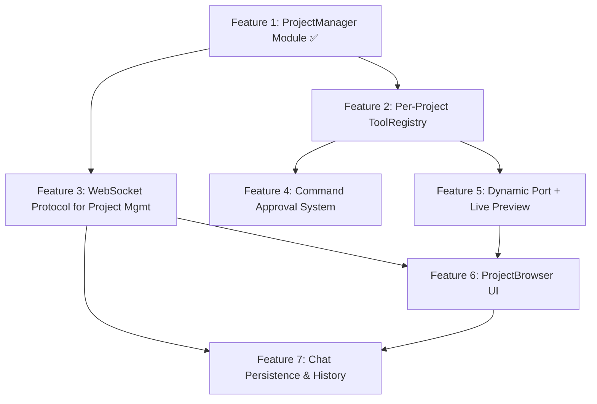

# Lowkey — Feature Roadmap & Implementation Guide

> **Last updated**: 2026-08-15  
> This document tracks all planned features for the Lowkey sandbox, project management, and preview system. Features are ordered by dependency — build them in sequence.

---

## Architecture Overview



---

## Feature 1: ProjectManager Module ✅ COMPLETED

**Goal**: A standalone Python module that manages `~/.lowkey/projects/` — creating, listing, deleting, and opening project directories.

### Files
| File | Action | Status |
|------|--------|--------|
| `backend/project_manager/__init__.py` | NEW | ✅ Done |
| `backend/project_manager/models.py` | NEW | ✅ Done |
| `backend/project_manager/manager.py` | NEW | ✅ Done |

### What It Does
- **`create_project(name)`** — Creates `~/.lowkey/projects/<name>/`, validates name (kebab-case, no collisions), writes `.lowkey_meta.json`, returns `ProjectInfo`.
- **`list_projects()`** — Scans root directory, reads metadata, checks process liveness via PID, returns list sorted by most recently opened.
- **`get_project(name)`** — Returns single `ProjectInfo` with resolved runtime status.
- **`delete_project(name)`** — Kills any running processes (SIGTERM → SIGKILL), removes directory.
- **`suggest_name(base_name)`** — Collision-safe name generation: `todo-app` → `todo-app-2` → `todo-app-3`.
- **`open_in_finder(name)`** — Cross-platform: `open` (macOS), `explorer` (Windows), `xdg-open` (Linux).
- **`update_meta(name, **fields)`** — Updates and persists metadata fields.
- **`touch_last_opened(name)`** — Shortcut to update `last_opened` timestamp.

### Key Design Decisions
- Each project stores its own `.lowkey_meta.json` — no global database.
- `status` is never persisted; it's derived at query time by checking if the stored PID is alive.
- Names validated via regex: `^[a-z0-9]+(?:-[a-z0-9]+)*$`, max 50 chars.
- `_slugify()` converts arbitrary text to kebab-case for LLM-generated names.

---

## Feature 2: Per-Project ToolRegistry

**Goal**: Refactor `ToolRegistry` so it's instantiated per-project (scoped to a specific project directory), not globally. Each WebSocket session gets its own isolated registry.

### Files
| File | Action |
|------|--------|
| `backend/tools/registry.py` | MODIFY |
| `backend/engine.py` | MODIFY |

### What Changes

**registry.py:**
- Constructor takes a `Path` (project path from `ProjectManager`) instead of a global sandbox string.
- Double-validation: path must exist AND be under `~/.lowkey/projects/`.
- `background_processes` dict stores richer metadata: `(pid, port, command)` tuples.
- New `get_active_processes()` method returns list of running process info for the UI.

**engine.py:**
- Remove global `SANDBOX_DIR` and global `tool_registry` singleton.
- Each WebSocket connection tracks `active_project` and its own `tool_registry`.
- When user sends `open_project`, instantiate a fresh `ToolRegistry(project.path)`.
- On disconnect, call `registry.cleanup()` for that session only.
- Multiple simultaneous WebSocket connections = multiple projects running in parallel.

### How to Verify
- Connect via WebSocket, open a project, send a prompt that writes a file → file lands in `~/.lowkey/projects/<name>/`.
- Try path traversal (`../../etc/passwd`) → rejected.
- Two WebSocket connections with different projects → fully isolated.

---

## Feature 3: REST API for Project Management

**Goal**: Build REST endpoints (HTTP) for project CRUD operations. This allows the frontend to fetch project lists and create projects instantly without being blocked by the AI agent's long-running WebSocket stream.

### Files
| File | Action |
|------|--------|
| `backend/engine.py` | MODIFY |

### New REST Endpoints

| Method | Route | Description | Response |
|--------|-------|-------------|----------|
| `GET` | `/api/projects` | List all projects | `[ProjectInfo, ...]` |
| `GET` | `/api/projects/suggest-name?base=todo` | Get collision-free name | `{"suggested_name": "todo-2"}` |
| `POST` | `/api/projects` | Create a new project | `ProjectInfo` |
| `DELETE`| `/api/projects/{name}` | Delete project + kill processes | `{"status": "deleted"}` |
| `POST` | `/api/projects/{name}/open-in-finder`| Open folder in OS | `{"status": "opened"}` |

*Note: The WebSocket will still handle the `"action": "open_project"` message to attach the active session to a specific project.*

### How to Verify
```bash
# Test endpoints via curl
curl http://127.0.0.1:8000/api/projects
curl -X POST -H "Content-Type: application/json" -d '{"name": "test-app"}' http://127.0.0.1:8000/api/projects
curl -X DELETE http://127.0.0.1:8000/api/projects/test-app
```

---

## Feature 4: Command Approval System

**Goal**: When the LLM agent calls `execute_command` or `run_background_command`, the system pauses, sends an approval request to the user via the UI, and waits for their response before executing.

### Files
| File | Action |
|------|--------|
| `backend/tools/registry.py` | MODIFY |
| `backend/tools/schemas.py` | MODIFY |
| `backend/config/prompts.py` | MODIFY |
| `backend/plugins/coding_harness.py` | MODIFY |
| `backend/engine.py` | MODIFY |
| `frontend/src/components/CommandApproval.jsx` | NEW |
| `frontend/src/components/CommandApproval.css` | NEW |
| `frontend/src/App.jsx` | MODIFY |

### Backend Flow
1. Agent calls `execute_command("npm install react", reason="Need React for UI")`.
2. **Blacklist filter** — Backend instantly rejects dangerous commands without bothering user:
   - `sudo`, `rm -rf`, `chmod 777`, `curl | sh`, `wget`, `npm -g`, path escapes `../../../`
   - Returns error to agent: `"Command rejected: {reason}"`
3. **Auto-approve check** — If command matches a pattern in `~/.lowkey/settings.json`, execute immediately.
4. **Approval request** — Backend yields event to frontend:
   ```json
   {
     "type": "command_approval_request",
     "request_id": "uuid-here",
     "command": "npm install react",
     "reason": "Need React for UI",
     "project": "todo-app"
   }
   ```
5. **Agentic loop pauses** — Harness `await`s an `asyncio.Event`.
6. **User responds** — Frontend sends `{ "action": "command_approval", "request_id": "...", "approved": true }`.
7. **Execution resumes** — If approved, run the command. If denied, return: `"User denied command. Find an alternative."`.

### Auto-Approve Settings
Stored in `~/.lowkey/settings.json`:
```json
{
  "auto_approve_patterns": [
    "npm install *",
    "npm run *",
    "npx *"
  ]
}
```
- Approval dialog includes checkbox: **"Always auto-approve commands like this"**.
- Checking it adds the pattern to `settings.json` for future sessions.
- Users can manage rules from a settings page (future feature).

### System Prompt Additions
Add to `CODING_SYSTEM_PROMPT`:
```
SANDBOX SAFETY RULES:
1. You are working inside an isolated project directory.
2. You may run package management commands but every command requires user approval.
3. Always provide a clear `reason` parameter when calling execute_command or run_background_command.
4. NEVER run destructive system commands (sudo, rm -rf, chmod, global installs).
5. NEVER attempt to access files outside the project directory.
6. When starting a dev server, use the port provided by the system.
```

### Tool Schema Changes
Add `reason` parameter to `execute_command` and `run_background_command`:
```json
"reason": {
    "type": "string",
    "description": "A one-sentence explanation of why this command needs to run."
}
```

### Frontend: CommandApproval Modal
```
┌──────────────────────────────────────────────┐
│  ⚠️  Command Approval Required               │
│                                              │
│  Command:                                    │
│  ┌────────────────────────────────────────┐  │
│  │ npm install react                      │  │
│  └────────────────────────────────────────┘  │
│                                              │
│  Reason: Need React for UI components        │
│  Directory: ~/.lowkey/projects/todo-app       │
│                                              │
│  ☐ Always auto-approve commands like this    │
│                                              │
│  [ Deny ]                    [ Approve & Run ]│
└──────────────────────────────────────────────┘
```

### How to Verify
1. Prompt triggers `npm install` → dialog appears → approve → installs.
2. Prompt triggers `rm -rf /` → blacklist catches it → no dialog, agent gets error.
3. Check "always auto-approve" → next `npm install` runs without dialog.
4. Deny a command → agent adapts.

---

## Feature 5: Dynamic Port Allocation + Live Preview

**Goal**: Automatically allocate free ports for dev servers, track them per-project, and dynamically update the iframe preview URL.

### Files
| File | Action |
|------|--------|
| `backend/tools/registry.py` | MODIFY |
| `backend/project_manager/manager.py` | MODIFY |
| `frontend/src/components/PreviewPanel.jsx` | MODIFY |
| `frontend/src/components/PreviewPanel.css` | MODIFY |
| `frontend/src/components/WorkspaceView.jsx` | MODIFY |

### Backend: Port Allocation
New method in `ToolRegistry`:
```python
def _find_free_port(self) -> int:
    with socket.socket(socket.AF_INET, socket.SOCK_STREAM) as s:
        s.bind(('', 0))
        return s.getsockname()[1]
```

Enhanced `run_background_command`:
1. Allocate free port via `_find_free_port()`.
2. Inject port into command (e.g., `npm run dev` → `npm run dev -- --port 54213`).
3. Start process, register `(pid, port)` with `ProjectManager`.
4. Yield `{ "type": "preview_ready", "port": 54213, "url": "http://localhost:54213" }`.

Enhanced `stop_background_command`:
- Yield `{ "type": "preview_stopped" }`.
- Clear port/pid from project metadata.

### Frontend: Dynamic PreviewPanel
- Accept `previewUrl` as a dynamic prop (not hardcoded `localhost:3000`).
- Default state: "No preview running" placeholder.
- On `preview_ready` event: set iframe `src`, show status bar.
- On `preview_stopped`: clear iframe, show placeholder.
- Status bar: `🟢 :54213 (PID: 48291) | [⏹ Stop] [🔄 Restart]`.

### Multi-Project
- Each WebSocket session tracks its own `previewUrl`.
- Multiple tabs/sessions can run different projects on different ports.

### How to Verify
1. Agent starts dev server → port auto-allocated → iframe shows preview.
2. Stop from UI → iframe clears, port freed.
3. Two projects → two different ports → both work simultaneously.
4. Disconnect → process killed → port freed.

---

## Feature 6: ProjectBrowser UI

**Goal**: A project selection and management screen — the landing page when users open the app.

### Files
| File | Action |
|------|--------|
| `frontend/src/components/ProjectBrowser.jsx` | NEW |
| `frontend/src/components/ProjectBrowser.css` | NEW |
| `frontend/src/App.jsx` | MODIFY |
| `frontend/src/components/WelcomeView.jsx` | MODIFY |

### Navigation Flow
```
App Opens → ProjectBrowser (grid of all projects)
  ├── "+ New Project" → WelcomeView (type first prompt)
  │     ├── LLM generates project name → user can edit
  │     └── Confirm → create_project → WorkspaceView (chat + preview)
  ├── Click existing project → open_project → WorkspaceView
  └── Delete → confirmation dialog → project removed
```

### App.jsx State
```javascript
currentView: "browser" | "welcome" | "workspace"
activeProject: ProjectInfo | null
```

### ProjectBrowser Layout
Grid of project cards, each showing:
- Project name + emoji/icon
- Status: 🟢 Running on `:54213` or ⏹️ Stopped
- Created date
- Actions: **Open**, **📂 Show in Finder**, **🗑️ Delete** (with confirmation)
- Prominent **"+ New Project"** button
- Empty state: "No projects yet. Create your first one!"

### New Project Name Flow
1. User clicks **"+ New Project"** → `WelcomeView`.
2. Types first prompt: "Build me a todo app".
3. Backend makes a quick LLM call → suggests `todo-app`.
4. Frontend shows editable name field: "Project name: **todo-app** ✏️".
5. User accepts or changes → `create_project(name)` → `WorkspaceView`.

### How to Verify
1. App opens → ProjectBrowser shows empty state.
2. Create project via prompt → auto-named → workspace opens.
3. Go back → project card appears.
4. Open project → workspace with that project.
5. Show in Finder → native file manager opens.
6. Delete → confirmation → removed from list and disk.

---

## Feature 7: Chat Persistence & History

**Goal**: Store all chat messages locally per-project so users can resume exactly where they left off when they reopen a project. All data stays on the user's machine — zero cloud dependency.

### Files
| File | Action |
|------|--------|
| `backend/project_manager/chat_store.py` | NEW |
| `backend/project_manager/models.py` | MODIFY (add chat-related types) |
| `backend/engine.py` | MODIFY (save/load chat on open/close) |
| `frontend/src/App.jsx` | MODIFY (load history on project open) |
| `frontend/src/components/ChatPanel.jsx` | MODIFY (render loaded history) |

### Storage Design
Each project gets a chat history file:
```
~/.lowkey/projects/todo-app/
├── .lowkey_meta.json          # Project metadata (already exists)
├── .lowkey_chat_history.jsonl  # Chat messages, one JSON object per line
├── src/
├── package.json
└── ...
```

**Why JSONL (JSON Lines)?**
- Each message is one line → append-only, no need to read/parse the entire file to add a new message.
- Easy to stream back to frontend on load.
- Crash-safe: even if the app dies mid-write, only the last line is corrupted.
- Easy to truncate/trim if the file grows too large.

### Message Format
Each line in `.lowkey_chat_history.jsonl`:
```json
{"role": "user", "content": "Build me a todo app", "timestamp": "2026-08-15T03:00:00Z"}
{"type": "thinking", "content": "I need to create...", "timestamp": "2026-08-15T03:00:01Z"}
{"type": "tool_call", "name": "write_file", "arguments": {"file_path": "index.html", "content": "..."}, "timestamp": "2026-08-15T03:00:02Z"}
{"type": "tool_result", "name": "write_file", "result": "Successfully wrote to index.html", "timestamp": "2026-08-15T03:00:02Z"}
{"type": "token", "content": "I've built your todo app...", "timestamp": "2026-08-15T03:00:05Z"}
{"type": "status", "content": "Done", "timestamp": "2026-08-15T03:00:06Z"}
```

This mirrors the exact same message format the frontend already uses — so loading history is just replaying messages into the existing `messages` state.

### ChatStore Class
```python
class ChatStore:
    """Append-only local chat storage for a single project."""

    def __init__(self, project_path: Path):
        self.history_file = project_path / ".lowkey_chat_history.jsonl"

    def append(self, message: dict) -> None:
        """Append a single message to the history file."""

    def load_all(self) -> List[dict]:
        """Load all messages from history (for resuming a session)."""

    def clear(self) -> None:
        """Clear chat history (user explicitly resets conversation)."""

    def get_conversation_messages(self) -> List[dict]:
        """Load messages in the format needed for the LLM conversation context
        (user + assistant + tool messages only, no UI-only events)."""
```

### Backend Flow

**Saving (during active session):**
- In `engine.py`, as the harness yields events (`token`, `tool_call`, `tool_result`, `status`, `thinking`), each event is simultaneously:
  1. Sent to the frontend via WebSocket (existing behavior).
  2. Appended to `.lowkey_chat_history.jsonl` via `ChatStore.append()`.
- User messages are also appended when received.

**Loading (when opening a project):**
- When the frontend sends `open_project`, the backend:
  1. Loads chat history via `ChatStore.load_all()`.
  2. Sends `{ "type": "chat_history", "messages": [...] }` to the frontend.
  3. Reconstructs the LLM conversation context via `ChatStore.get_conversation_messages()` so the agent has memory of prior turns.

**Clearing:**
- User clicks "New Chat" or "Clear History" in the UI.
- Frontend sends `{ "action": "clear_chat", "project": "todo-app" }`.
- Backend clears the JSONL file AND resets `session_messages` in memory.

### Frontend Flow

**On project open:**
1. Receive `chat_history` message from backend.
2. Set `messages` state to the loaded history array.
3. `ChatPanel` renders all historical messages (tool calls collapsed by default).
4. User can continue chatting — new messages append normally.

**Visual indicator:**
- Show a subtle divider in the chat: `── Previous session ──` between loaded history and new messages.

### Conversation Context Management
The tricky part: when resuming a project, the LLM needs the **conversation context** (not just UI messages) to understand what was built previously.

- `ChatStore.get_conversation_messages()` extracts only `user`, `assistant`, and `tool` role messages — the format needed for the Ollama API's `messages` parameter.
- These are loaded into `session_messages` in `engine.py` so the harness passes them to the LLM.
- To prevent context overflow with local models, apply a sliding window: keep the last N messages (e.g., last 20 turns) plus the system prompt.

### Edge Cases
- **Large files in tool results**: When a `write_file` call wrote a large file, the tool result may be very long. On reload, truncate large tool results to a summary (e.g., "Wrote 450 lines to src/App.jsx").
- **Stale server references**: If the previous session started a dev server on port 54213, but the app was closed and the process died, the chat history will reference that port. The system prompt should instruct the agent to re-verify server status when resuming.
- **Concurrent sessions**: If two tabs open the same project, both append to the same file. Use file locking (`fcntl.flock`) or accept last-write-wins for the JSONL append.

### How to Verify
1. Create project → chat with agent → close project.
2. Reopen project → previous chat messages appear.
3. Agent remembers context → can continue building from where it left off.
4. Clear history → chat resets → agent has no memory of prior work.
5. Large history → loads within 1-2 seconds (JSONL is fast).

---

## Build Order Summary

| Order | Feature | Size | Dependencies | Status |
|-------|---------|------|-------------|--------|
| 1 | ProjectManager Module | Small | None | ✅ Done |
| 2 | Per-Project ToolRegistry | Medium | Feature 1 | ⬜ Pending |
| 3 | WebSocket Protocol | Small | Feature 1 | ⬜ Pending |
| 4 | Command Approval System | Large | Feature 2 | ⬜ Pending |
| 5 | Dynamic Port + Live Preview | Medium | Feature 2 | ⬜ Pending |
| 6 | ProjectBrowser UI | Medium | Features 3, 5 | ⬜ Pending |
| 7 | Chat Persistence & History | Medium | Features 3, 6 | ⬜ Pending |
