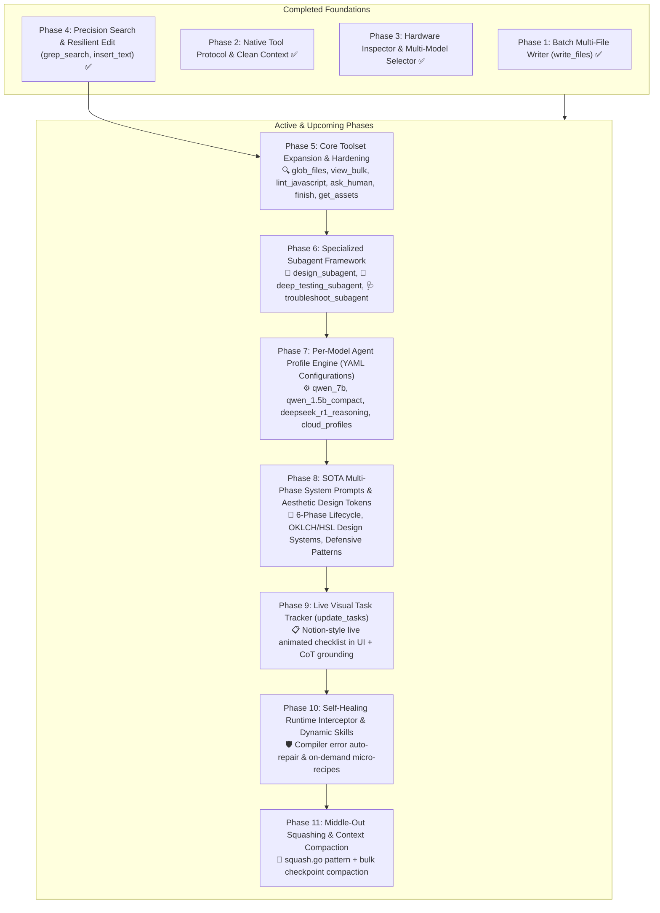
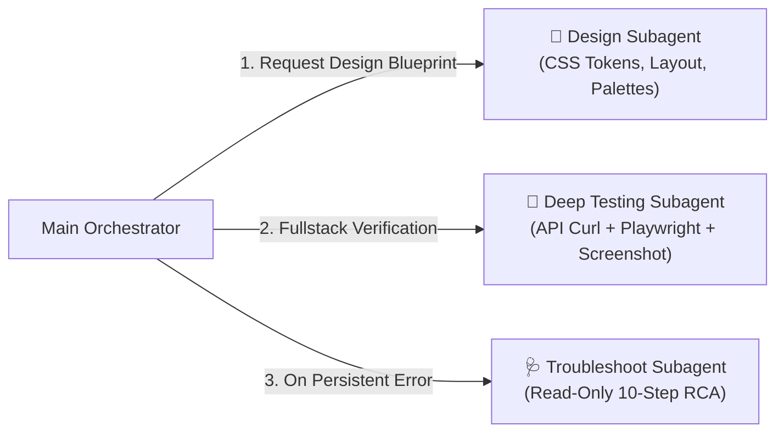

# Lowkey: Comprehensive Implementation Phases & Architecture Blueprint

This document outlines the complete, phased implementation plan for **Lowkey**—integrating the proven multi-agent orchestration, specialized subagents, precision tooling, and per-model configurations from Emergent (`mono/cortex`) while maintaining Lowkey's local-first, zero-latency desktop architecture.

---

## 1. Architectural Gap Analysis & Cross-Check Matrix

| Category | Emergent SOTA (`mono/cortex`) | Lowkey Current State | Gap / Required Addition | Priority |
| :--- | :--- | :--- | :--- | :--- |
| **Tools: File Discovery** | `glob_files`, `view_bulk`, `view_file` | `list_directory`, `read_file` | Add `glob_files` & `view_bulk` (batch multi-file reading in 1 turn). | **P0 (Critical)** |
| **Tools: Syntax & Linting** | `lint_javascript`, `lint_python` | *None* (Vite crashes only) | Add `lint_javascript` (ESLint/syntax check before saving). | **P0 (Critical)** |
| **Tools: Code Editing** | `search_replace` (`replace_all`), `apply_patch` | `edit_file` (1st match only), `insert_text` | Add `replace_all` & multi-match support to `edit_file`. | **P1 (High)** |
| **Tools: Interaction** | `ask_human`, `finish`, `test_finish` | Simple stream end | Add structured `ask_human` (multiple-choice UI) and `finish` tools. | **P1 (High)** |
| **Tools: Assets & Media** | `get_assets_tool`, `image_selector_tool` | *None* (Hallucinates URLs) | Add `get_assets_tool` (curated Lucide icons & stock image CDN URLs). | **P1 (High)** |
| **Subagents: Design** | `design_agent_v1` (Gemini 3.1 Pro / 1M) | *None* (Generic plain styles) | Add `design_subagent` generating CSS variables, palettes, typography. | **P0 (Critical)** |
| **Subagents: Testing** | `testing_agent_v4` (Fullstack + Playwright) | `ui_subagent.py` (DOM-only) | Add `deep_testing_subagent` (API curl + Playwright + screenshots + logs). | **P0 (Critical)** |
| **Subagents: RCA / Debug** | `troubleshoot_agent` (10-step RCA) | *None* | Add `troubleshoot_subagent` (read-only diagnostic agent for crashes). | **P1 (High)** |
| **Per-Model Configs** | Distinct YAMLs per model (`opus`, `sonnet`, `codex`, `gpt_5_4`) | Single hardcoded `prompts.py` | Create `backend/config/agents/*.yaml` with model-tuned toolsets. | **P0 (Critical)** |
| **System Prompts** | 6-phase lifecycle + aesthetic mandates | Single 48-line text prompt | Overhaul prompt with 6-phase workflow + rich aesthetic design tokens. | **P0 (Critical)** |
| **UI Task Tracker** | `todo_write` live task list | *None* in UI | Add `update_tasks` tool + Notion-style live animated task checklist. | **P1 (High)** |
| **Self-Healing** | Runtime log watcher & auto-repair | Manual prompt needed | Add automatic Vite compiler & Express runtime error interceptor. | **P2 (Medium)** |
| **Context Management**| `squash.go` middle-out truncation | Basic string clipping | Implement middle-out tool truncation + 75% context compaction. | **P2 (Medium)** |

---

## 2. Master Implementation Phases Overview



---

## Phase 5: Core Toolset Expansion & Hardening (P0 — Immediate)

### 1. Goals:
- Eliminate high-latency multi-turn file discovery by adding `glob_files` and `view_bulk`.
- Prevent broken syntax from reaching the dev server by adding `lint_javascript`.
- Provide structured human clarification (`ask_human`) and formal task completion (`finish`).
- Provide realistic stock media and icons via `get_assets_tool` so models never hallucinate broken placeholder URLs.

### 2. Detailed Technical Deliverables:
1. **`glob_files(pattern: str, path: str = ".") -> str`**:
   - Uses `pathlib.Path.glob` to find matching files while respecting `.gitignore`, `node_modules`, `dist`, `.git`.
   - Supports patterns like `src/**/*.jsx`, `server/**/*.js`, `*.json`.
2. **`view_bulk(files: List[str]) -> str`**:
   - Reads up to 10 files in a single batched tool execution with numbered line headers.
   - Slashes exploration turns from $N$ roundtrips to 1 roundtrip.
3. **`lint_javascript(file_path: str) -> str`**:
   - Runs a fast local Node.js syntax/ESLint validation check on the file and returns line-numbered syntax errors or `"No syntax errors found"`.
4. **`edit_file` enhancements**:
   - Add `replace_all: bool = False` to enable renaming variables, CSS classes, or imports across an entire file.
5. **`ask_human(question: str, choices: List[str] = None) -> str`**:
   - Triggers a WebSocket event `{"type": "ask_human_request", "question": "...", "choices": [...]}`.
   - Pauses the agent execution loop until the user selects an option or writes a custom reply in the UI.
6. **`finish(summary: str, files_modified: List[str], features_verified: List[str]) -> str`**:
   - Clean termination tool providing a structured summary of changes, features built, and verification results.
7. **`get_assets_tool(category: str, query: str) -> str`**:
   - Returns curated, working Unsplash/Lucide asset URLs with semantic tags (e.g. `avatars`, `hero_landscapes`, `product_thumbnails`, `lucide_icons`).

### 3. Files to Modify / Create:
- `backend/tools/registry.py`: Implement the 7 new/updated tool functions.
- `backend/tools/schemas.py`: Register JSON schemas for all new tools.
- `backend/plugins/coding_harness.py`: Support `ask_human` asynchronous event pause/resume.
- `frontend/src/components/AskHumanModal.jsx` & CSS: Interactive modal rendered when `ask_human` is invoked.
- `backend/test_phase5_tools.py`: Comprehensive test suite verifying all tool operations.

---

## Phase 6: Specialized Subagent Framework (P0 — Critical)

### 1. Goals:
- Transform Lowkey from a single-agent script into a coordinated multi-agent studio.
- Replace the primitive `ui_subagent.py` with three production-grade subagents.



### 2. Subagent Specifications:

#### A. `DesignSubagent` (`backend/subagents/design_subagent.py`)
- **Purpose**: Generates high-end visual design systems before frontend code is created.
- **Input**: `{ "problem_statement": "...", "app_type": "dashboard|saas|ecommerce|landing", "user_preferences": "..." }`
- **Output**: A comprehensive design blueprint containing:
  - **Color Palette Tokens**: CSS custom properties for Primary, Secondary, Background, Surface, Card, Accent, Border (in OKLCH / HSL).
  - **Typography & Font Rules**: Google Font pairing (e.g. Inter / Plus Jakarta Sans), scale, line-heights.
  - **Component Aesthetics**: Glassmorphism blur values, card shadows, rounded corner radiuses, badge styles.
  - **Micro-Animations**: Hover transitions, tab active states, pulsing badges, smooth fade-ins.
  - Ready-to-paste `src/index.css` design system variables.

#### B. `DeepTestingSubagent` (`backend/subagents/testing_subagent.py`)
- **Purpose**: Autonomous full-stack verification combining backend API checks and browser automation.
- **Capabilities**:
  1. **Phase 1: Backend API Verification**: Uses `httpx` to ping `/api/*` endpoints with payload variations, asserting 200 OK, JSON structure, and DB persistence.
  2. **Phase 2: Headless Playwright UI Testing**: Launches Chromium, navigates to the app, clicks buttons, fills inputs, and asserts UI updates.
  3. **Console & Network Error Capture**: Listens to `page.on("console")` and `page.on("requestfailed")` to catch uncaught React exceptions and 404/500 API responses.
  4. **Screenshot Capture**: Saves visual snapshots to `.lowkey/screenshots/` and inspects element visibility.
  5. **Structured Report**: Generates `test_reports/iteration_X.json` detailing passed tests, failed tests, logs, and recommended fixes.

#### C. `TroubleshootSubagent` (`backend/subagents/troubleshoot_subagent.py`)
- **Purpose**: Read-only systematic root-cause analysis (RCA) triggered when dev servers crash, ports collide, or 2+ edit attempts fail.
- **Operation**: Operates under strict read-only access (can only use `read_file`, `grep_search`, `list_directory`, `view_bulk`). Conducts a 5–10 step investigation and outputs a concise root cause diagnosis and exact fix recommendation.

### 3. Files to Modify / Create:
- `backend/subagents/design_subagent.py`: Implement `DesignSubagent`.
- `backend/subagents/testing_subagent.py`: Implement `DeepTestingSubagent` (replacing `ui_subagent.py`).
- `backend/subagents/troubleshoot_subagent.py`: Implement `TroubleshootSubagent`.
- `backend/tools/registry.py` & `schemas.py`: Register subagent invoker tools (`run_design_agent`, `run_testing_agent`, `run_troubleshoot_agent`).
- `backend/test_phase6_subagents.py`: End-to-end unit tests for all three subagents.

---

## Phase 7: Per-Model Agent Profile Engine (YAML Configs) (P0 — Critical)

### 1. Goals:
- Provide model-tailored configurations matching Emergent's multi-YAML approach.
- Slices toolsets and adapts prompting based on model parameter size and reasoning capabilities.

### 2. Architecture & Profile Matrix:

```
backend/config/agents/
├── qwen2.5_coder_7b.yaml      # Standard local tool-calling flagship (full toolset)
├── qwen2.5_coder_14b_32b.yaml  # High-accuracy multi-subagent orchestration
├── qwen2.5_coder_1.5b_3b.yaml  # Lightweight profile (streamlined 5-tool set)
├── deepseek_r1_reasoning.yaml # CoT reasoning with fallback JSON parser
├── codestral_22b.yaml         # Mistral coding flagship with diff editing
└── cloud_frontier.yaml        # Claude 3.7 / GPT-5.4 / Gemini 3.1 Pro APIs
```

#### Profile Specifications:

| Model Tier | Toolset Sizing | Function Calling Mode | Subagents Enabled | System Prompt Variant |
| :--- | :--- | :--- | :--- | :--- |
| **Ultra-Lightweight (1.5B – 3B)** | 5 Core Tools (`read_file`, `write_file`, `edit_file`, `execute_command`, `finish`) | Strict Minimal Schemas | None (Single agent) | Ultra-concise, zero-ambiguity prompt |
| **Standard Flagship (7B – 14B)** | Full Toolset (14 Tools) | Native OpenAI Function Calling | All (Design, Testing, Troubleshoot) | 6-Phase Lifecycle Prompt |
| **Reasoning Distills (DeepSeek-R1)**| Full Toolset (14 Tools) | `<think>` Stripping + JSON Fallback Parser | All | CoT Prompt with Structured Fallback Guide |
| **Workstation / Cloud (32B+, Claude, GPT)**| Full Toolset + Patch Tools | Parallel Tool Calling + Diff Patching | All + Deep Refactoring | Comprehensive Emergent Orchestrator Prompt |

### 3. Files to Modify / Create:
- `backend/config/agents/*.yaml`: Define YAML specs for each model tier.
- `backend/config/agent_loader.py`: YAML parser resolving tool whitelists, subagents, prompt IDs, and parameters for the active model.
- `backend/plugins/coding_harness.py`: Dynamically load the resolved agent profile from `agent_loader.py`.
- `backend/test_phase7_profiles.py`: Test suite validating profile resolution across all 18 models in `config/models.py`.

---

## Phase 8: SOTA Multi-Phase System Prompts & Aesthetic Design Directives (P0 — High Impact)

### 1. Goals:
- Transform code quality from "generic functional MVP" to "visually stunning, production-grade application".
- Implement the rigorous 6-phase engineering lifecycle used by Emergent's cloud orchestrators.

### 2. Core Prompt Sections:

#### A. 6-Phase Engineering Lifecycle Protocol:
1. **Phase 1: Clarification & Alignment**: If user requirements are underspecified, call `ask_human` with 2–4 concise multiple-choice options before writing code.
2. **Phase 2: UI/UX Design System**: Invoke `design_subagent` to generate bespoke color tokens (CSS variables), typography rules, and card styling.
3. **Phase 3: Codebase Discovery & Planning**: Use `glob_files` and `view_bulk` to inspect existing project structure. Initialize the task plan with `update_tasks`.
4. **Phase 4: Backend Implementation**: Write ES Module Express routes in `server/index.js` with CORS, JSON body parser, and resilient in-memory stores. Verify endpoints.
5. **Phase 5: Frontend Implementation**: Write modular React components in `src/App.jsx` and styling in `src/index.css` incorporating design tokens, loading spinners, empty states, and error boundaries.
6. **Phase 6: Fullstack Deep Testing & Finish**: Invoke `deep_testing_subagent` to verify API and UI. Review test report, fix any defects, and call `finish`.

#### B. Rich Aesthetics & Modern UI Directives:
- **No Generic Colors**: Mandate cohesive palettes (slate/zinc dark surfaces, vibrant accents like emerald, indigo, violet, cyan via HSL/OKLCH).
- **Modern Typography**: Use curated font stacks (`Inter`, `Plus Jakarta Sans`, `Geist`) with defined line-height and letter-spacing hierarchies.
- **Glassmorphism & Depth**: Subtle multi-layer box shadows (`box-shadow: 0 4px 20px -2px rgba(0,0,0,0.2)`), translucent card borders (`border: 1px solid rgba(255,255,255,0.08)`), and backdrop blurs.
- **Interactive Micro-States**: Every clickable button and card must have hover scaling (`transform: translateY(-1px)`), active press states, smooth CSS transitions (`transition: all 0.2s cubic-bezier(0.4, 0, 0.2, 1)`), and disabled states.
- **Zero-Placeholder Mandate**: Always populate rich mock data with realistic names, numbers, timestamps, and working asset URLs from `get_assets_tool`. Never output `TODO` or `Lorem Ipsum`.

#### C. Defensive Full-Stack Engineering Rules:
- Express endpoints must wrap async handlers in `try/catch` and return `{ "success": false, "error": "..." }` with appropriate HTTP status codes.
- React components must handle loading states (`isLoading ? <Spinner /> : ...`), empty array states (`items.length === 0 ? <EmptyIllustration /> : ...`), and fetch error handling.

### 3. Files to Modify / Create:
- `backend/config/prompts.py`: Overhaul system prompts with the multi-phase lifecycle and aesthetic design rules.
- `backend/templates/node_react/src/index.css`: Pre-scaffold modern CSS variable tokens and utility classes.

---

## Phase 9: Live Visual Task Tracker (`update_tasks` / `todo_write`) (P1 — Visuals & CoT)

### 1. Goals:
- Provide real-time UI transparency of what the agent is currently planning, executing, and completing.
- Ground smaller 7B/14B models into sequential chain-of-thought task execution (modeled after Emergent's `todo_write`).

### 2. Technical Deliverables:
1. **Tool `update_tasks(tasks: List[Dict[str, str]])`**:
   - Accepts task items with `id`, `title`, and `status` (`pending`, `in_progress`, `completed`, `cancelled`).
2. **WebSocket Event Dispatching**:
   - Streams `{"type": "task_update", "tasks": [...]}` to the frontend on every state change.
3. **Frontend Notion-Style Task Checklist**:
   - `frontend/src/components/TaskChecklist.jsx` & CSS: An elegant, collapsible checklist rendered in the chat panel with:
     - 🟡 Pulsing indicator for active `in_progress` tasks.
     - 🟢 Clean checkmark and subtle strike-through for `completed` tasks.
     - ⚪ Dimmed state for `pending` tasks.
     - Progress counter (e.g. `3 of 5 tasks completed`).

---

## Phase 10: Self-Healing Runtime Interceptor & Dynamic Skills (P2 — Reliability)

### 1. Goals:
- Automatically intercept Vite compiler syntax errors and Express crashes, feeding them back to the agent for instant self-repair before user intervention.
- Provide on-demand micro-recipes for complex libraries (Chart.js, Lucide, Dexie, DnD) via `load_skill`.

### 2. Technical Deliverables:
1. **Runtime Error Interceptor**:
   - Monitored background process stderr/stdout stream. If Vite outputs `[vite] Internal server error` or Express emits `UnhandledPromiseRejection`, format the error with the offending file path and line number and trigger an autonomous repair turn.
2. **Skill Library (`backend/skills/`)**:
   - Markdown micro-recipes containing minimal, tested boilerplate for:
     - `charts.md` (Chart.js / Recharts integration).
     - `lucide_icons.md` (Lucide React icon inventory and import syntax).
     - `storage_dexie.md` (Client-side IndexedDB persistence).
     - `kanban_dnd.md` (Lightweight drag-and-drop state management).
   - Tool `load_skill(skill_name: str)` to fetch recipes dynamically.

---

## Phase 11: Middle-Out Squashing & Context Compaction (P2 — Stability)

### 1. Goals:
- Enable infinite-length multi-turn development sessions without hitting context overflow or degrading model reasoning (modeled after Emergent's `squash.go` pattern).

### 2. Technical Deliverables:
1. **Middle-Out Tool Output Truncation**:
   - For massive tool outputs (large file reads, verbose npm logs), retain the first 300 characters (header/context) and the last 250 characters (return status/error messages), replacing the middle with `… [N lines / chars truncated] …`.
2. **Bulk Checkpoint Compaction**:
   - When cumulative conversation tokens exceed 75% of the model's context window, summarize earlier completed task milestones into clean state checkpoints, keeping the last 10 messages intact.

---

## 3. Verification & Quality Gates per Phase

| Phase | Automated Test Target | Manual / E2E Verification Target |
| :--- | :--- | :--- |
| **Phase 5 (Tools)** | `pytest test_phase5_tools.py` (100% pass on 7 tools) | Verify `glob_files` and `view_bulk` in a multi-file project. |
| **Phase 6 (Subagents)**| `pytest test_phase6_subagents.py` (Unit tests with mocks) | Run `DeepTestingSubagent` on a live Express+React app. |
| **Phase 7 (Profiles)** | `pytest test_phase7_profiles.py` (Validate all 18 models) | Switch between Qwen 2.5 Coder 7B and DeepSeek R1 7B. |
| **Phase 8 (Prompts)** | `pytest test_phase8_prompts.py` (Prompt syntax & anchors) | 1-shot fullstack app creation with rich dark theme aesthetics. |
| **Phase 9 (Tasks)** | `pytest test_phase9_tasks.py` (WebSocket task events) | Visual check of animated Notion checklist in UI. |
| **Phase 10 (Self-Heal)**| `pytest test_phase10_skills.py` (Skill loading & error trap) | Intentionally write a syntax error and verify auto-repair. |
| **Phase 11 (Squash)** | `pytest test_phase11_squash.py` (Middle-out truncation test) | Multi-turn 30-message session without context degradation. |
