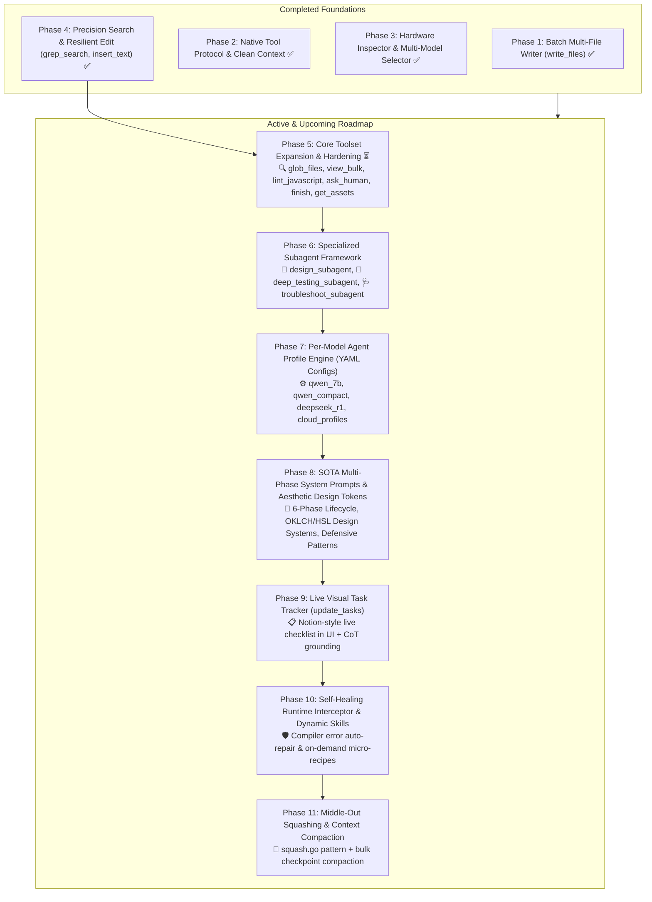

# Master Implementation Plan: Advanced Agent Tooling & Architecture for Lowkey

This document details the step-by-step roadmap to enhance Lowkey into an ultra-fast, visually transparent, resilient, hardware-adaptive, and multi-model local AI software studio, drawing on production-proven patterns from Emergent (`mono/cortex`).

---

## 1. Executive Summary & Core Architectural Decisions

1. **Universal Living Skeleton over Multi-Template Overhead**:
   - Single ultra-fast Node.js (Express ES Module) + React 18 (Vite) + Lucide Icons + CSS design tokens living skeleton.
   - Eliminates the 7B "refactoring penalty" where local models struggle to scaffold and re-architect multi-framework boilerplate from scratch.

2. **Universal Multi-Model Tool Calling & Argument Normalization (Emergent `xllm` & `mcp_stringify_fix` pattern)**:
   - **Dual-Mode Dispatch**: Native structured function calling (`tools=TOOL_SCHEMAS`) for tool-native models (Qwen 2.5 Coder, Llama 3.1, Codestral) + universal JSON schema protocol in prompts for reasoning models (DeepSeek R1, Gemma).
   - **Resilient Argument Middleware**: Automatic deserialization of stringified JSON arguments, key aliasing (`path` $\rightarrow$ `file_path`, `cmd` $\rightarrow$ `command`), and dict-to-array conversions (`{"test.txt": "..."}` $\rightarrow$ `[{"file_path": "test.txt", ...}]`).

3. **Disk-First Context Architecture & Middle-Out Tool Truncation (Emergent `squash.go` pattern)**:
   - The workspace filesystem is the single source of truth. Raw markdown code blocks are strictly stripped from conversation history to prevent models from learning to chat code instead of executing tools.
   - **Middle-Out Truncation**: When tool outputs exceed token limits, keep the start (300 chars) and tail (200 chars) with `…N chars truncated…` rather than hard-clipping the end, preserving critical return status and syntax errors.
   - **Recency Anchoring**: Force 7B attention focus to the immediate active task.

4. **Multi-Agent Orchestration & Specialized Subagents (Emergent `farm_agents` pattern)**:
   - Dedicated **Design Subagent** (`design_subagent.py`) for OKLCH/HSL tokens, typography, and layout blueprints.
   - Dedicated **Deep Testing Subagent** (`testing_subagent.py`) combining backend API verification (`httpx`) and frontend Playwright automation with screenshot and console error capture.
   - Dedicated **Troubleshoot Subagent** (`troubleshoot_subagent.py`) providing 10-step read-only root cause analysis.

5. **Per-Model YAML Profiles & Capacity-Aware Toolsets (Emergent `Agent` YAML pattern)**:
   - Separate YAML agent configurations for each model tier (1.5B/3B compact, 7B/14B standard, DeepSeek-R1 reasoning, and 32B+/Cloud frontier) to match tool counts and prompt formats to model capabilities.

---

## 2. Master Phased Roadmap

---

## Phase 1: Batch Multi-File Writer (`write_files`) & 1-Turn Generation ✅ COMPLETED
* **Goal**: Enable the agent to create/update all application files (`server/index.js`, `src/App.jsx`, `src/components/*`, `src/index.css`) in a single atomic tool call.
* **Delivered Changes**:
  - `backend/tools/registry.py`: Added `write_files(files=[{"file_path": "...", "content": "..."}])` with atomic writes and path safety.
  - `backend/tools/schemas.py`: Registered `write_files` JSON schema.
  - `backend/utils/context_manager.py`: Parsed modified files from `write_files`.
  - `frontend/src/components/ChatMessage.jsx` & `ChatMessage.css`: Added file badge display pills.
  - `backend/test_batch_write.py`: Verified unit and 1-turn E2E generation with `qwen2.5-coder:7b`.

---

## Phase 2: Native Tool Protocol & Clean Context Architecture ✅ COMPLETED
* **Goal**: Eliminate prompt conflicts, decommission complex string-hacking stream normalizers, sanitize conversation history to prevent few-shot code chatting, and establish strict autonomous bug-fixing behavior.
* **Delivered Changes**:
  - `backend/config/prompts.py`: Stripped manual JSON/XML formatting instructions; added explicit autonomous bug-fixing protocol; focused system prompts 100% on domain engineering rules.
  - `backend/utils/context_manager.py`: Implemented Disk-First context sanitization (markdown code block stripping) and recency anchoring (`RECENCY_ANCHOR`) to prevent 7B attention fading.
  - `backend/plugins/coding_harness.py`: Stream directly from native provider fields (`chunk.message.thinking`, `chunk.message.tool_calls`, `chunk.message.content`).
  - `backend/utils/stream_normalizer.py`: Replaced 280-line complex lexer with lightweight `StreamEventDispatcher`.
  - `backend/tools/parser.py`: Streamlined `ToolCallParser` to a clean, lightweight fallback parser.
  - `backend/test_phase2.py`: 100% pass rate on unit test suite verifying prompts, sanitization, anchoring, fallback parsing, and streaming events.

---

## Phase 3: Hardware-Aware Dynamic Model Selector & Multi-Model Support ✅ COMPLETED
* **Goal**: Real-time hardware inspection (CPU, RAM, Apple Silicon Unified Memory), automated compatibility scoring (Optimal, Usable, Insufficient), interactive welcome-screen model catalog, 1-click model switching, download/pull streaming, model deletion, and universal multi-model tool support (Qwen 2.5 Coder + DeepSeek R1).
* **Delivered Changes**:
  - `backend/utils/hardware.py`: Zero-overhead system inspector extracting OS, architecture, chip name, CPU cores, total RAM, and Apple Silicon unified memory status.
  - `backend/config/models.py`: Curated 18-model catalog and dynamic compatibility evaluator based on memory footprint.
  - `backend/engine.py`:
    - Added `GET /api/system/models-and-hardware` endpoint.
    - Added `POST /api/models/pull` with Server-Sent Events (SSE) streaming download progress.
    - Added `DELETE /api/models/{model_name}` to allow users to delete downloaded models from local disk.
    - Added dynamic `model` dispatching in WebSocket chat handler.
  - `backend/tools/parser.py` & `coding_harness.py`: Enhanced multi-model parser and argument normalization middleware for DeepSeek R1 and alternative JSON conventions.
  - `frontend/src/components/ModelSelector.jsx` & `ModelSelector.css`: Notion-style modal with search filter, direct custom tag pull, compatibility tier badges, live download progress, and deletion confirmation.
  - `frontend/src/components/WelcomeView.jsx` & `ChatPanel.jsx`: Positioned model selector trigger button directly below prompt input textareas on both screens.
  - `backend/test_phase3_models.py`: 100% pass rate on unit test suite verifying hardware detection, RAM estimation, compatibility tiering, catalog building, and REST endpoints.

---

## Phase 4: Precision Code Search, Line Slicing & Resilient Editing (`grep_search`, `read_file`, `insert_text`, `edit_file`) ✅ COMPLETED
* **Goal**: Minimize context consumption and enable fast, surgical 1-line bug fixes, line insertions, and resilient editing without rewriting full files.
* **Delivered Changes**:
  - `backend/tools/registry.py`:
    - Upgraded `read_file(file_path, start_line, end_line)` to support line-range slicing with 1-indexed numbered line formatting.
    - Added `grep_search(query, path, case_sensitive)` to search code across the workspace and return matching line numbers (~20 tokens).
    - Added `insert_text(file_path, line_number, text)` for direct line insertion without string matching.
    - Upgraded `edit_file(file_path, old_text, new_text)` with 3-stage resilient matching (exact, whitespace/indentation normalized, and quote-tolerant).
  - `backend/tools/schemas.py`: Registered JSON schemas for `grep_search` and `insert_text`; updated `read_file` and `edit_file`.
  - `backend/config/prompts.py`: Updated system prompts with search $\rightarrow$ edit/insert $\rightarrow$ done two-step action protocol.
  - `backend/utils/context_manager.py`: Removed generic filler completion phrases; accurately records file inspection vs modification summaries.
  - `backend/test_phase4_tools.py`: 100% pass rate across precision search, line slicing, line insertions, and fuzzy editing.

---

## Phase 5: Core Toolset Expansion & Hardening ⏳ NEXT UP
* **Goal**: Close all remaining tool gaps with Emergent by adding multi-file pattern discovery (`glob_files`), multi-file batched reading (`view_bulk`), pre-save syntax validation (`lint_javascript`), interactive clarification (`ask_human`), task completion summary (`finish`), and curated asset resolution (`get_assets_tool`).
* **Planned Changes**:
  - `backend/tools/registry.py`:
    - `glob_files(pattern, path)`: Fast path matcher with `.gitignore` and `node_modules` exclusion.
    - `view_bulk(files)`: Multi-file reader reading up to 10 files in 1 roundtrip.
    - `lint_javascript(file_path)`: Node.js static syntax & JSX validator.
    - `ask_human(question, choices)`: Interactive clarification request modal.
    - `finish(summary, files_modified, features_verified)`: Formal task completion.
    - `get_assets_tool(category, query)`: Working Unsplash/Lucide asset URL fetcher.
    - `edit_file(..., replace_all=True)`: Full-file symbol & class renaming support.
  - `backend/tools/schemas.py`: Register JSON schemas for all new tools.
  - `backend/plugins/coding_harness.py`: Support `ask_human` pause/resume cycle.
  - `frontend/src/components/AskHumanModal.jsx`: Interactive modal for user multiple-choice selection.
  - `backend/test_phase5_tools.py`: Unit test suite verifying all 7 tool additions.

---

## Phase 6: Specialized Subagent Framework
* **Goal**: Implement specialized, modular subagents replacing the primitive `ui_subagent.py`.
* **Planned Changes**:
  - `backend/subagents/design_subagent.py`: Generates OKLCH/HSL color palettes, typography, glassmorphism tokens, and layout blueprints.
  - `backend/subagents/testing_subagent.py`: Full-stack testing agent executing backend `httpx` API endpoint tests, Playwright browser automation, screenshots, console error listeners, and structured JSON test reports.
  - `backend/subagents/troubleshoot_subagent.py`: Read-only 10-step root cause analysis (RCA) specialist for persistent server crashes and port conflicts.
  - `backend/tools/registry.py` & `schemas.py`: Register subagent invoker tools (`run_design_agent`, `run_testing_agent`, `run_troubleshoot_agent`).
  - `backend/test_phase6_subagents.py`: Complete test suite for subagent delegation.

---

## Phase 7: Per-Model Agent Profile Engine (YAML Configs)
* **Goal**: Provide model-tailored YAML configurations matching Emergent's multi-YAML architecture (`qwen2.5_coder_7b.yaml`, `deepseek_r1.yaml`, `qwen_compact_1.5b.yaml`, `cloud_frontier.yaml`).
* **Planned Changes**:
  - `backend/config/agents/*.yaml`: Define YAML specs for each model tier (tool whitelists, subagents, prompt IDs, reasoning params).
  - `backend/config/agent_loader.py`: YAML parser and dynamic config resolver based on the active model.
  - `backend/plugins/coding_harness.py`: Integrate dynamic profile resolution into the agent execution loop.
  - `backend/test_phase7_profiles.py`: Test suite validating profile resolution across all 18 models.

---

## Phase 8: SOTA Multi-Phase System Prompts & Aesthetic Design Directives
* **Goal**: Overhaul system prompts with Emergent's 6-phase engineering lifecycle and rich aesthetic design system mandates.
* **Planned Changes**:
  - `backend/config/prompts.py`:
    - 6-Phase Lifecycle: Clarification $\rightarrow$ Design Blueprint $\rightarrow$ Architecture $\rightarrow$ Backend $\rightarrow$ Frontend $\rightarrow$ Deep Testing $\rightarrow$ Finish.
    - Rich Aesthetics Rules: Dark/light cohesive palettes (OKLCH/HSL), curated typography (`Inter`, `Plus Jakarta Sans`), glassmorphism, responsive flex/grid, micro-interactions, zero-placeholder mandate.
    - Defensive Full-Stack Rules: Express async `try/catch` error handlers, React loading/empty states, error boundaries.
  - `backend/templates/node_react/src/index.css`: Pre-scaffold modern CSS variable tokens and utility classes.

---

## Phase 9: Live Visual Task Tracker (`update_tasks` / `todo_write`)
* **Goal**: Real-time progress transparency in the UI and chain-of-thought grounding for smaller models.
* **Planned Changes**:
  - `backend/tools/registry.py` & `schemas.py`: Add `update_tasks(tasks=[{"id": "...", "title": "...", "status": "pending|in_progress|completed"}])`.
  - `backend/plugins/coding_harness.py`: Forward task events over WebSocket.
  - `frontend/src/components/TaskChecklist.jsx` & CSS: Notion-style animated checklist in the chat panel with active pulsing indicators and completion counters.

---

## Phase 10: Self-Healing Runtime Interceptor & Dynamic Skills
* **Goal**: Automatically catch Vite compiler errors and Express crashes for instant self-repair, and provide on-demand micro-recipes via `load_skill`.
* **Planned Changes**:
  - `backend/tools/registry.py`: Dev server stderr/stdout stream error watcher.
  - `backend/plugins/coding_harness.py`: Intercept compiler error overlays and trigger auto-repair turn.
  - `backend/skills/*.md`: Curated recipes for `charts.md`, `lucide_icons.md`, `storage_dexie.md`, `kanban_dnd.md`.
  - `backend/tools/registry.py`: Add `load_skill(skill_name)` tool.

---

## Phase 11: Middle-Out Squashing & Context Compaction (Emergent `squash.go` pattern)
* **Goal**: Infinite-length multi-turn stability without context overflow.
* **Planned Changes**:
  - `backend/utils/stream_normalizer.py` & `coding_harness.py`: Implement middle-out tool output truncation (preserve first 300 and last 250 chars).
  - `backend/utils/context_manager.py`: Bulk checkpoint compaction when context reaches >75% window.
